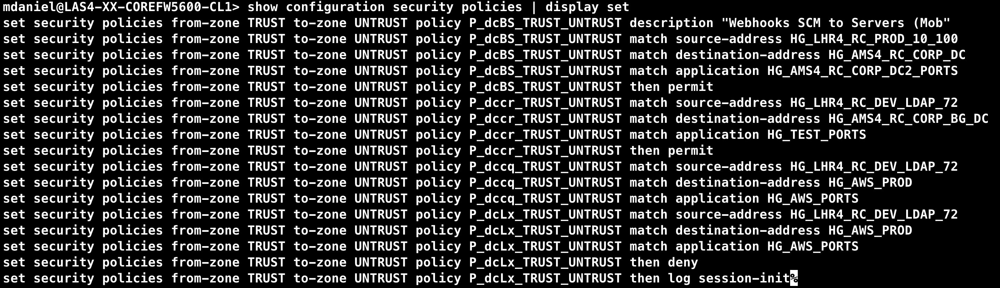
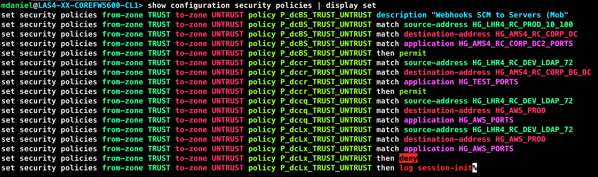

# netcli-highlight

## TOC

## What's this about
If you have ever used the CLI on network devices, you probably have ended up frustrated trying to make sense of the long lines of configuration. Although nowadays the use of editors like `Sublime/Vscode/Atmom` can provide some really useful syntax highlighting, you still can find yourself struggling to read the config files or outputs while you are on live devices.

 

**Here we have a Juniper SRX firewall policy.** This rule is comprised by source/destination/application/actions, if you need to read one of them it's alright but if your output has you reading over 10 rules you can see how difficult is to differentiate each component.

**Wouldn't be nice to have some live syntax highlight to differentiate each component and quickly find what you are looking for?** Something like...

If you are like me, fascinated by the concept of marginal gains, this will config will help youto read config files and output quicker, and in general to work better in the CLI.

**Note: The default color code has been tested using a Dark terminal Background as you can see in the images above**
## Use-cases

- Reading Firewall Rules (JunOS)
- Reading show ip bgp summary (Cisco / Arista)
- Reading show interfaces (Cisco / Arista / JunOS)
- 

## Benefits
- Quicker troubleshooting as you can create your own regex/color combination to identify important information like: Inteface is Down, the BGP session is not Established, or see the last time an interface flapped, it is just limited to what is important for you.
- Color codes can be totally customised to your liking. To see the available HTML color codes go [HERE](https://htmlcolorcodes.com/)

## Pre-requisites
 - Python 3.6+
 - [Chromaterm](https://github.com/hSaria/ChromaTerm) - A big shout out to **hSaria** for buliding this wonderful too.

## Usage

## TO-DO
- [ ] Video presenting the colors
- [ ] 

## Purpose
The purpose of this repo is just to give you an idea of the power of having a syntax highlighting **while working on live devices**.

## Limitations
- There are countless of NOS and versions so not all of them would probably work with this config file but you can easily modify it to filter the content you consider important and even use customise the colors to your liking.

- This config file has been tested with some Juniper, Cisco and Arista devices.

## Contributions / Thanks
Thanks to 